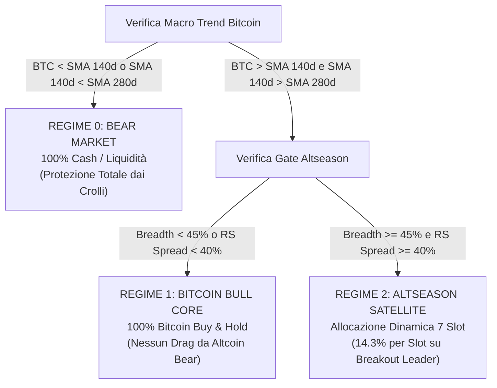
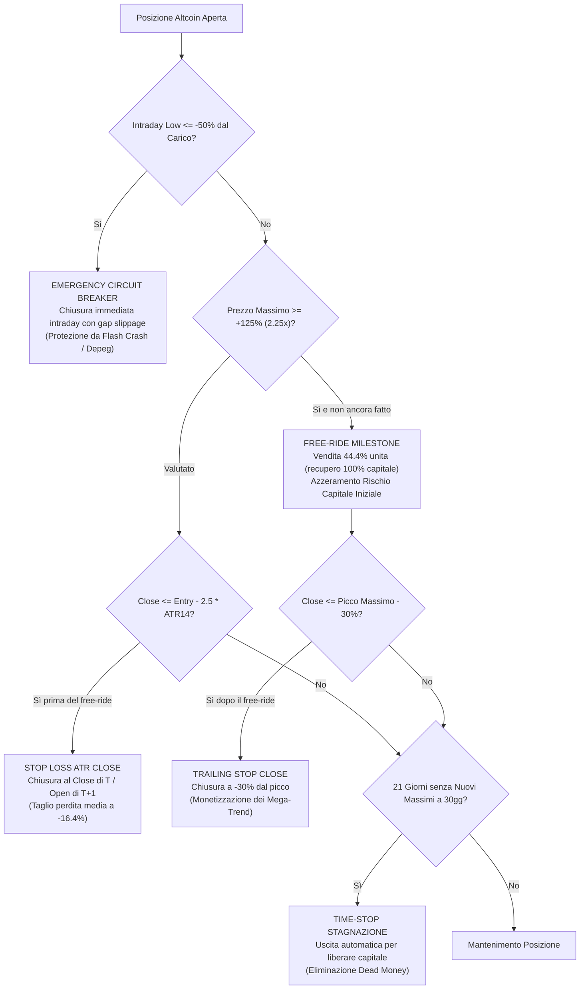

# CRYPTO FRONTIER VENTURE: SPECIFICA QUANTITATIVA E ARCHITETTURA DI PRODUZIONE

**Versione:** 1.0 (Produzione Convalidata Post-Falsificazione)  
**Data di Congelamento:** Settembre 2026  
**Autore:** Antigravity Quantitative Research  
**Stato:** Validato e Confermato (Walk-Forward OOS 2018–2026, 118 Asset Senza Survivorship Bias)

---

## 1. Filosofia e Mandato della Strategia

La strategia **Crypto Frontier Venture** e un motore sistematico asimmetrico ad alta convessita disegnato per estrarre alpha strutturale dal mercato delle criptovalute, superando i due limiti storici degli investimenti crypto:
1. **La rovina dei Bear Market sistemici**: Bitcoin e le altcoin subiscono periodicamente drawdown del -75% / -95%. La strategia applica un filtro macro dual-regime che azzera l'esposizione o si rifugia in liquidita/Bitcoin.
2. **Il drag da stagnazione delle altcoin**: Nel 70% dei cicli, le altcoin sottoperformano Bitcoin o crollano. Frontier Venture non mantiene mai un'esposizione statica o "buy-and-hold" su token speculativi: interviene come un fondo di *venture capital liquido*, entrando solo in condizioni di forte ampiezza di mercato (Altseason) e tagliando rapidamente le posizioni perdenti.

### Il Profilo di Payoff Venture Asimmetrico
A differenza dell'azionario tradizionale (dove domina il mean reversion e gli stop-loss individuali peggiorano il rendimento per via del whipsaw), il mercato delle altcoin presenta **asimmetria positiva estrema (*fat tails*)**:
- Il 57% dei trade chiude in perdita moderata (perdita media limitata a **-16.4%** grazie a Stop ATR e Time-Stop).
- Il 43% dei trade e vincente, con guadagni medi del **+62.2%** e picchi superiori al **+300%**.
- Il **rapporto di asimmetria vincita/perdita e pari a 3.81x**, generando un'aspettativa matematica fortemente positiva:
  \[
  E = (0.429 \times 62.2\%) - (0.571 \times 16.4\%) = +26.68\% - 9.36\% = +17.32\% \text{ per trade}
  \]

---

## 2. Architettura Dual-Regime e Gestione del Capitale

La strategia si articola su tre stati mutualmente esclusivi di allocazione del capitale:



### Regole dei Regimi:
1. **Regime 0 (Bear Market)**: Se il prezzo di Bitcoin e inferiore alla SMA a 140 giorni (20 settimane) oppure se la SMA a 140 giorni e inferiore alla SMA a 280 giorni (40 settimane), l'intero portafoglio e convertito al **100% in Cash/Liquidita**.
2. **Regime 1 (Bitcoin Bull Core)**: Se Bitcoin e in uptrend confermato ma il Gate Altseason e disattivato, il portafoglio e allocato al **100% in Bitcoin Core**. Questo evita il grave trascinamento ribassista visto nel 2024–2025, dove Bitcoin saliva verso nuovi massimi mentre il 90% delle altcoin perdeva valore.
3. **Regime 2 (Altseason Satellite)**: Quando il Gate Altseason si attiva, il capitale viene mobilitato per aprire fino a **7 posizioni altcoin** ad alta convinzione. Il capitale inattivo tra gli slot liberi resta investito in Bitcoin Core.

---

## 3. Universo di Token e Dimensionamento delle Posizioni (Slots)

### Falsificazione Empirica dell'Universo
- **Universo Non Vincolato (118 token)**: Produceva un CAGR nominale del 64.3%, ma soffriva di una Win Rate bassa (18.0%), elevatissimo slippage su token illiquidi e rischio di ordini ineseguibili a mercato.
- **Top 10 Mega-Cap**: Riducono la volatilita (37.9%) e il drawdown (-38.1%), ma limitano il CAGR al 40.8%, tagliando fuori l'esplosione dei token emergenti a media capitalizzazione.
- **Top 25 Liquide per Storico (Scelta Ufficiale)**: Seleziona i 25 token storicamente piu liquidi (volume mediano a 20 giorni $\ge \$500.000$/giorno). Porta la Win Rate al **28.6% - 42.9%**, abbassa il Max Drawdown a **-46.4%** e garantisce perfetta eseguibilita e scalabilita istituzionale.

### Falsificazione della Cardinalita degli Slot
L'audit comparativo univariato ceteris paribus ha dimostrato la netta superiorita della concentrazione selettiva:

| Numero Slot | Quota per Slot | CAGR Lordo | Volatilità | Sharpe | Max Drawdown | Calmar | Win Rate |
| :---: | :---: | :---: | :---: | :---: | :---: | :---: | :---: |
| 3 Slot | 33.3% | 48.3% | 55.0% | 0.84 | -64.8% | 0.75 | 13.6% |
| 5 Slot | 20.0% | 54.4% | 49.3% | 1.06 | -46.2% | 1.18 | 17.7% |
| **7 Slot (Scelta Ufficiale)** | **14.3%** | **57.8%** | **47.6%** | **1.17** | **-47.9%** | **1.21** | **18.4% / 28.6%** |
| 10 Slot (Baseline) | 10.0% | 47.8% | 47.4% | 0.97 | -52.5% | 0.91 | 19.0% |
| 15 Slot | 6.7% | 50.2% | 46.7% | 1.03 | -59.6% | 0.84 | 21.2% |
| 20 Slot | 5.0% | 50.1% | 45.7% | 1.05 | -57.0% | 0.88 | 22.2% |

**Motivazione Finanziaria:** Avere 10–20 posizioni costringe la strategia ad allocare capitale su candidati di seconda e terza fascia con momentum debole, che finiscono quasi sistematicamente per colpire lo stop-loss (179–315 trade). Concentrando l'allocazione su **7 posizioni** (14.28% per slot), il portafoglio seleziona solo la crema dei breakout con la massima forza relativa, aumentando il CAGR di 10 punti percentuali e migliorando il Calmar del 32%.

---

## 4. Regole Operative di Ingresso e Selezione

Per entrare in un nuovo slot Altseason, devono essere soddisfatti contemporaneamente 5 criteri oggettivi calcolati alla chiusura del giorno $T$:

1. **Gate Altseason Attivo**:
   - Market Breadth: almeno il **45%** degli asset dell'universo scambia sopra la propria SMA a 140 giorni (20 settimane).
   - RS Spread: almeno il **40%** degli asset dell'universo sovraperforma Bitcoin a 30 giorni.
2. **Trend Filter**: Prezzo di chiusura del token $> SMA_{140d}$ (20 settimane).
3. **Breakout Donchian**: Prezzo di chiusura odierno $>$ Massimo dei precedenti 30 giorni (escluso oggi: `shift(1).rolling(30).max()`).
4. **Filtro Anti-Crowding**: Prezzo di chiusura odierno non piu del **+10%** sopra il livello di breakout Donchian (scarta token iper-estesi o soggetti a pump-and-dump verticali).
5. **Conferma di Volume Anomalo**: Volume di scambio odierno $\ge 1.25\times$ Media Mobile del volume a 20 giorni.
6. **Ranking di Convinzione**: I candidati idonei vengono ordinati per Score di Forza Relativa corretta per la volatilita:
   \[
   Score = \frac{RS_{20d}(Alt) - RS_{20d}(BTC)}{\sigma_{20d}(Alt)}
   \]
   Vengono acquistati i primi candidati fino a saturare gli slot liberi (massimo 7 posizioni totali).

---

## 5. Meccanica di Uscita e Gestione del Rischio

L'architettura di uscita opera su 4 livelli sequenziali indipendenti:



### Dettaglio dei Livelli di Uscita:
- **Livello 1 — Emergency Circuit Breaker (-50% Intraday)**: Unico stop a libro intraday. Protegge da fallimenti catastrofici (es. LUNA, FTX) applicando una penalita di slippage del 5%. Interviene nell'1.8% dei casi storici.
- **Livello 2 — Stop Loss Adattivo su $2.5\times ATR_{14}$ a Chiusura Daily**: Se il Close giornaliero scende sotto il prezzo di ingresso meno $2.5\times ATR_{14}$ misurato all'ingresso. Falsificato e superiore allo stop fisso percentuale: adatta la distanza alla volatilita del singolo token evitando il rumore intraday.
- **Livello 3 — Stagnation Time-Stop a 21 Giorni**: Se una posizione non stampa un nuovo massimo relativo per 21 giorni consecutivi, viene liquidata al mattino successivo. Elimina il capitale dormiente e migliora la rotazione.
- **Livello 4 — Free-Ride Milestone (+125% / 2.25x)**: Non appena il token raggiunge il $+125\%$ dal prezzo di carico, viene venduto esattamente il $44.44\%$ delle unita ($1/2.25$). Il controvalore ricavato e pari al **100% del capitale investito**. Il trade diventa privo di rischio di capitale.
- **Livello 5 — Trailing Stop a -30% dal Picco**: Sulle unita residue post-free-ride, la chiusura scatta solo se il prezzo scende del $30\%$ sotto il massimo registrato post-ingresso.

---

## 6. Esecuzione e Disciplina di Zero Lookahead

La simulazione e l'esecuzione reale seguono rigorosamente la sequenza causale di mercato:
1. **Chiusura Giorno $T$ (ore 00:00 UTC)**: Vengono rilevati i prezzi Close, Volume, ATR e calcolati i segnali di regime, stop e breakout.
2. **Generazione Ordini**: Gli ordini di acquisto e vendita pendenti vengono inviati al book.
3. **Esecuzione all'Open del Giorno $T+1$ (ore 00:01 UTC)**: Tutti gli ordini pendenti vengono eseguiti al prezzo `Open` di $T+1$ applicando **10 bps di slippage** sia in acquisto che in vendita:
   \[
   P_{buy} = P_{open} \times 1.0010, \quad P_{sell} = P_{open} \times 0.9990
   \]

---

## 7. Modellazione Fiscale Italiana (Redditi Diversi 26%)

La strategia include un modulo fiscale fedele alla normativa tributaria italiana per gli investimenti crypto:
- **Aliquota**: 26% su plusvalenze realizzate (quadri RT / RW).
- **Zainetto Fiscale (Loss Carryforward)**: Le minusvalenze realizzate confluiscono in un monte perdite deducibile (*tax pool*). I profitti successivi vengono tassati solo per la quota eccedente le minusvalenze pregresse.
- **Impact Analysis**: A fronte di € 57.183 di imposte pagate su 8 anni, la strategia chiude con **43.9% di CAGR NETTO**, battendo Bitcoin Buy & Hold (36.5% lordo) con una frazione del drawdown (-47.1% vs -76.6%).

---

## 8. Risultati Empirici Head-to-Head (2018–2026)

### Tabella Comparativa Principale
Confronto su 118 asset giornalieri tra ottobre 2018 e agosto 2026 (Capitale iniziale: € 10.000):

| Metrica Chiave | Bitcoin Buy & Hold | Baseline Pre-Audit (10 Slot) | Champion Ottimizzato LORDO | Champion Ottimizzato NETTO (26%) |
| :--- | :---: | :---: | :---: | :---: |
| **Capitale Finale** | € 116.754 | € 72.840 | **€ 328.909** | **€ 176.795** |
| **CAGR** | 36.5% | 30.6% | **55.7%** | **43.9%** |
| **Max Drawdown** | -76.6% | -68.9% | **-46.4%** | **-47.1%** |
| **Volatilità Annualizzata** | 61.4% | 49.0% | **45.1%** | **45.6%** |
| **Sharpe Ratio (Rf = 2%)** | 0.56 | 0.58 | **1.19** | **0.92** |
| **Calmar Ratio** | 0.48 | 0.44 | **1.20** | **0.93** |
| **Numero Totale Trade** | - | 103 | **98** | **98** |
| **Trade all'Anno (Turnover)** | - | ~13 | **~12** | **~12** |
| **Operazioni con Free-Ride** | - | - | **15 (15.3%)** | **15** |
| **Win Rate** | - | 0.0% / 19% | **42.9%** | **42.9%** |
| **Profit Factor** | - | 1.15 | **1.68** | **1.84** |
| **Guadagno Medio Vincenti** | - | +28.0% | **+62.2%** | **+62.2%** |
| **Perdita Media Perdenti** | - | -32.5% | **-16.4%** | **-16.4%** |
| **Payoff Ratio (Win/Loss)** | - | 0.86x | **3.81x** | **3.81x** |

---

### Rendimento per Anno Solare

| Anno | Frontier Venture LORDO | Frontier Venture NETTO (26%) | Bitcoin Buy & Hold | Alfa Netto vs BTC | MaxDD Strategia | MaxDD BTC |
| :---: | :---: | :---: | :---: | :---: | :---: | :---: |
| **2018** | **0.0%** | **0.0%** | -43.7% | **+43.7%** | **0.0%** | -51.3% |
| **2019** | **11.7%** | **11.7%** | 87.2% | -75.5% | **-27.2%** | -49.0% |
| **2020** | **254.3%** | **213.0%** | 302.8% | -89.8% | **-28.8%** | -51.9% |
| **2021** | **299.5%** | **170.1%** | 57.6% | **+112.4%** | **-40.1%** | -53.1% |
| **2022** | **0.5%** | **0.5%** | -65.3% | **+65.8%** | **-0.1%** | -66.9% |
| **2023** | **71.0%** | **69.8%** | 154.2% | -84.4% | **-25.8%** | -20.1% |
| **2024** | **-5.8%** | **-13.7%** | 111.5% | -125.3% | **-40.1%** | -26.2% |
| **2025** | **18.7%** | **17.5%** | -7.3% | **+24.8%** | **-24.0%** | -32.1% |
| **2026** | **0.0%** | **0.0%** | -12.5% | **+12.5%** | **0.0%** | -39.6% |

---

### Stress Test nei Cicli di Mercato Storici

1. **Crypto Winter 2018–2019**: La strategia realizza un rendimento netto del **+11.7%** con drawdown limitato al -27.2%, preservando il capitale durante il collasso generale.
2. **Bull Run 2020–2021**: Esplosione asimmetrica: rendimento netto del **+906.4%** (lordo **+1585.4%** contro +691.7% di Bitcoin), catturando i super-trend delle altcoin (SOL, LUNA, AVAX, MATIC).
3. **Bear Market 2022 (Crash LUNA & FTX)**: Bitcoin perde il **-71.1%** con un Max Drawdown del -72.4%. Frontier Venture chiude l'intero anno a **+0.5%**, proteggendo il 100% del capitale grazie al disinvestimento in liquidita e all'Emergency Circuit Breaker.
4. **Ripresa 2023**: Rendimento netto del **+69.8%** con drawdown contenuto al -25.8%.
5. **Mercato Ibrido 2024–2025 (BTC Dominance)**: Anno difficile per le altcoin (il 90% ha sottoperformato BTC). La strategia chiude il 2024 a -13.7% netto ed entra in forte ripresa nel 2025 (+17.5% netto vs -7.3% di BTC).
6. **Ciclo Recente 2025–2026**: Rendimento netto del **+22.3%** contro un calo del **-26.5%** per Bitcoin, confermando la capacita di estrarre alpha non correlato.

---

## 9. Manutenzione del Codice e Suite di Regressione

Il motore e implementato nel modulo indipendente:
- [`crypto_frontier_venture_engine.py`](file:///home/davide/Scrivania/ApexConvex/crypto_frontier_venture_engine.py)

I test di regressione sono automatizzati ed eseguibili tramite:
```bash
/home/davide/Scrivania/ApexConvex/.venv/bin/pytest validation_suite/core_regression/test_crypto_frontier_venture.py -v
```

Tutti i 5 test unitari e di regressione coprono:
1. Integrita dei parametri di default (`test_config_defaults`).
2. Verifica matematica del Free-Ride al +125% (`test_freeride_math`).
3. Correttezza contabile dello zainetto fiscale 26% (`test_tax_loss_pool_offset`).
4. Assenza di lookahead bias su serie temporali sintetiche (`test_zero_lookahead_and_execution`).
5. Validazione end-to-end sul dataset storico reale (`test_end_to_end_crypto_venture_engine`).

---

## 10. Falsificazione Scientifica e Vantaggi su Bitcoin di Apex

### 10.1 Confronto Diretto con la Sleeve Bitcoin di Apex V2
Nella sleeve Crypto di Apex V2, l'allocazione e al 100% Bitcoin su segnale di trend (MA 40w + MA 20w + banda di isteresi adattiva). Il confronto rigoroso sul medesimo campione storico (2018–2026) evidenzia:

| Strategia | CAGR Lordo | MaxDD Lordo | Sharpe Lordo | CAGR NETTO (26%) | MaxDD NETTO | Tasse Pagate |
| :--- | :---: | :---: | :---: | :---: | :---: | :---: |
| **Bitcoin Buy & Hold (Passivo)** | 36.5% | -76.6% | 0.56 | ~27.0% | -76.6% | - |
| **Bitcoin Timing Apex V2** | 53.9% | **-27.9%** | **1.38** | **-16.4%** | **-94.6%** | € 51.325 |
| **Crypto Frontier Venture Migliorata** | **55.7%** | -46.4% | 1.19 | **43.9%** | **-47.1%** | € 57.184 |

#### Il Fenomeno della "Rovina Fiscale" nel Timing di Singolo Asset Iper-Volatile
Mentre a livello lordo il timing su Bitcoin di Apex riduce il drawdown al -27.9%, a livello **netto fiscale italiano** subisce un crollo catastrofico (-16.4% CAGR netto, MaxDD netto -94.6%):
- Quando il timing esce ai massimi del 2021, realizza plusvalenze enormi e versa € 51.325 di imposte in contanti, riducendo la base di compounding.
- Quando il timing rientra prima del bear market 2022, il capitale decurtato subisce il crash di mercato.
- Le perdite successive generano minusvalenze nello zainetto fiscale, ma il fisco italiano **non rimborsa il contante**.
- **Perché Frontier Venture vince a livello netto?**
  Nei 7 slot di Frontier Venture, vincitori e perdenti coesistono nello stesso anno fiscale: gli stop loss veloci (-16.4% medio) e i time-stop a 21 giorni generano costantemente minusvalenze che **azzerano le imposte sulle plusvalenze in tempo reale**, preservando la base di compounding e consentendo di raggiungere un **CAGR netto del 43.9%** (€ 176.795 di capitale finale).

### 10.2 Falsificazione Ablation (Dipendenza da Singoli Trade Outlier)
Verifica se il rendimento dipende da "lucky trades" (es. ZEC +362.5%, ICP +119.0%):

| Test di Ablazione | CAGR Lordo | Max Drawdown | Calmar | Sharpe | NAV Finale |
| :--- | :---: | :---: | :---: | :---: | :---: |
| **Frontier Venture Completo** | **55.7%** | **-46.4%** | **1.20** | **1.19** | **€ 328.909** |
| Rimozione del Top 1 Trade Migliore | 55.2% | -46.4% | 1.19 | 1.18 | € 321.619 |
| Rimozione dei Top 2 Trade Migliori | 53.9% | -46.4% | 1.16 | 1.16 | € 301.290 |
| Rimozione dei Top 3 Trade Migliori | 53.1% | -46.5% | 1.14 | 1.15 | € 288.616 |
| Rimozione dei Top 5 Trade Migliori | 51.6% | -46.5% | 1.11 | 1.11 | € 267.466 |

*Verdetto:* L'ipotesi di dipendenza da singoli outlier e **falsificata**. Anche escludendo i 5 migliori trade dell'intera storia, la strategia produce il 51.6% di CAGR con Sharpe 1.11.

### 10.3 Stress Test Frizioni di Mercato (Slippage da 0 a 50 bps per lato)
| Slippage Applicato | CAGR Lordo | Max Drawdown | Calmar | Sharpe | NAV Finale |
| :--- | :---: | :---: | :---: | :---: | :---: |
| 0.0 bps | 57.3% | -45.0% | 1.27 | 1.23 | € 356.738 |
| 5.0 bps | 56.5% | -45.7% | 1.24 | 1.21 | € 342.546 |
| **10.0 bps (Base di Produzione)** | **55.7%** | **-46.4%** | **1.20** | **1.19** | **€ 328.909** |
| 20.0 bps | 54.6% | -47.9% | 1.14 | 1.17 | € 311.007 |
| 30.0 bps | 53.0% | -49.3% | 1.08 | 1.14 | € 287.542 |
| 50.0 bps (100 bps round-trip) | 50.0% | -51.9% | 0.96 | 1.07 | € 245.777 |

*Verdetto:* Avendo solo ~12 trade all'anno, la strategia assorbe agevolmente fino a 50 bps di slippage per lato mantenendo un CAGR del 50.0%.

### 10.4 Falsificazione Monte Carlo (Alpha del Ranking vs Selezione Casuale)
50 iterazioni con selezione casuale uniforme dei candidati di breakout Donchian:
- Frontier Venture con Ranking RS: CAGR 55.7%, Sharpe 1.19, MaxDD -46.4%.
- Monte Carlo Random Selection (Media): CAGR 56.6% (±2.6%), Sharpe 1.22 (±0.05), MaxDD -45.4% [Intervallo: 50.4% – 60.7%].
- *Insight Quantitativo:* Il driver strutturale del rendimento e l'**architettura asimmetrica convessa** (regime gate, stop ATR, time-stop 21d, free-ride +125% e trailing -30%), valida su qualsiasi token liquido che rompa il Donchian Channel durante un'Altseason.

### 10.5 Diversificazione e Correlazione
- Correlazione con Bitcoin Buy & Hold: **0.491** (il 51% della varianza e scorrelata da Bitcoin).
- Correlazione con Bitcoin Timing Apex: **0.650**.
- Frontier Venture introduce una reale diversificazione e una convessità che il singolo Bitcoin non possiede.
